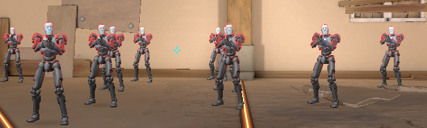
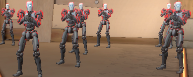

# Valorant True Stretch

A simple tool to properly configure Valorant for stretched resolution without any black bars.


## Showcase

<div align="center">
  <table>
    <tr>
      <td align="center"><b>Before (with black bars)</b></td>
      <td align="center"><b>After (true stretched)</b></td>
    </tr>
    <tr>
      <td></td>
      <td></td>
    </tr>
  </table>
</div>

## Features
- Easy resolution changing
- Automatically disables letterboxing
- Configures proper fullscreen settings
- Simple and user-friendly interface
- Automatically closes game processes before applying changes

## How to Use
1. Download the latest release from the [releases page](../../releases)
2. Change your resolution to the stretched resolution you want to play on from NVIDIA Control Panel before running the tool.
3. Run the program as administrator
4. Enter your desired resolution (e.g., 1280×960)
5. Click "Apply Settings"
6. Launch Valorant and enjoy true stretched resolution!

## Important Notes
- Make sure to close the game before using this tool
- The program will automatically close Valorant and Riot Client processes if they're running
- You might need to temporarily disable your antivirus

## Requirements
- Windows 10/11
- Valorant installed
- Administrator privileges

## Building from Source
```bash
# Clone the repository
git clone https://github.com/vo1dcheater/Valorant-True-Stretch.git

# Create virtual environment
python -m venv .venv

# Activate virtual environment
.venv\Scripts\activate

# Install requirements
pip install pyinstaller

# Build executable
pyinstaller --onefile valo_config.py
```

## Need Help?
If you need help, feel free to contact me on Telegram: [@voidcheater](https://t.me/voidcheater)

## Contributing
If you find any issues or have suggestions for improvements, please open an [issue](../../issues) or submit a [pull request](../../pulls).

## License
This project is licensed under the [MIT License](LICENSE)
